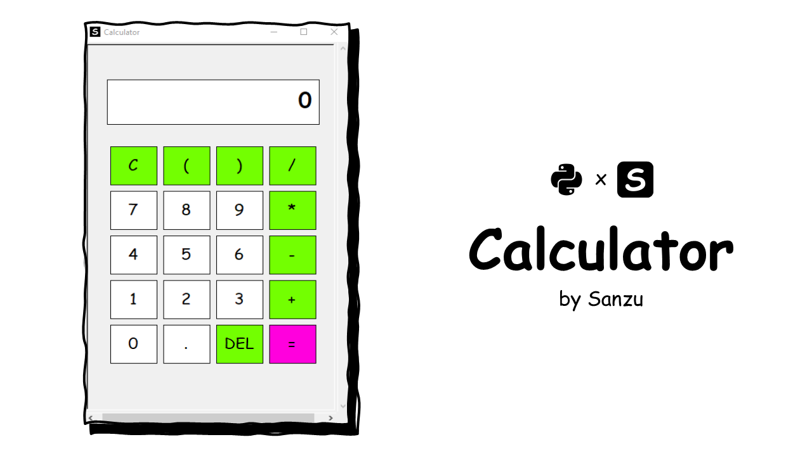

<p align="center">
  
</p>

## Calculator
A sleek, functional graphical calculator built using Python’s **Turtle** graphics module and **Tkinter**. This project demonstrates how to create a custom user interface, handle click events, and perform mathematical evaluations in a visual environment.

### Features

* **Custom GUI:** A completely custom-drawn interface using Turtle graphics.
* **Dynamic Styling:** Color-coded buttons (White for numbers, Green for operators, Pink for equals).
* **Interactive Input:** Full support for mouse-click interactions.
* **Math Logic:** Handles addition, subtraction, multiplication, division, and parentheses using Python's evaluation logic.
* **Smart Display:** Includes an "Error" catch for invalid equations and a character limit with truncation to keep the display clean.
* **Icon Support:** Built-in support to display a custom `icon.png` in the window title bar.

### Prerequisites

* **Python 3.x**
* The `turtle` and `tkinter` libraries (usually included by default with Python installations).

### Installation

1. Clone this repository or download the source code.
2. (Optional) Place an image named `icon.png` in the same directory to customize the window icon.
3. Run the script:
```bash
python calculator.py
```

### How it Works

The application uses two separate Turtle objects to manage the experience:

1. **The Drawer:** Responsible for rendering the static UI elements like buttons and the display box.
2. **The Display Pen:** Responsible for updating the text on the screen every time a button is pressed.

### Button Hitbox Logic

Since Turtle graphics don't have built-in buttons, this script uses **coordinate mapping**. Every button's `(x, y)` boundaries are stored in a list. When you click, the script checks if your mouse coordinates fall within any of those stored boundaries.

### Key Configurations

You can easily customize the look in the `Configuration` section of the code:

* **FONT:** Change the font style or size for buttons.
* **COLORS:** Modify the hex codes in `build_ui()` to change the theme.

### Usage Note

The calculator uses Python's `eval()` function to calculate results. While efficient for a local tool, ensure you only use it for trusted inputs.

### Contributing

Feel free to fork this project and add features like:

* Keyboard support (binding keys to turtle functions).
* Advanced math functions (square roots, percentages).
* Dark mode toggle.

---
Credit: `Sanzu`
